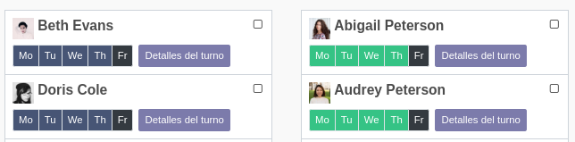

When there's a public holiday for an employees work address no shift will be assigned
for that day. Those days will be marked as black in the assingment card.

By default it is not possible to assign a shift template on a public holiday.
If your company does work on some public holidays, enable *Shift assignment
overrides public holidays* in the Employees settings: lines keep being flagged
as holidays, but explicitly assigning a template to them turns them into
regular working shifts.
